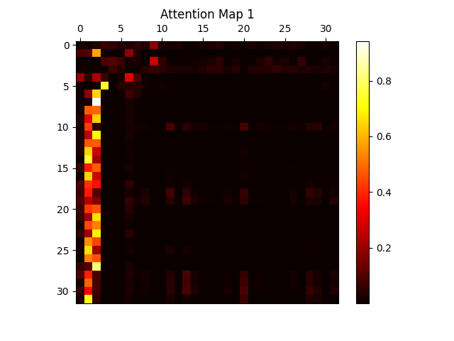
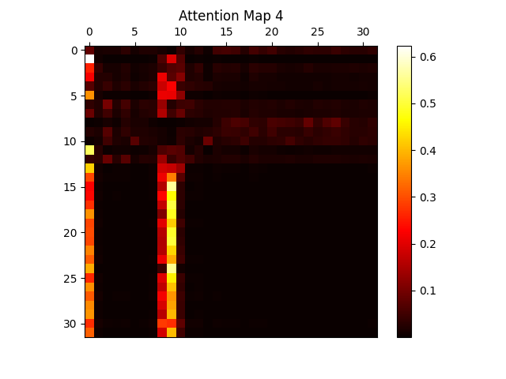
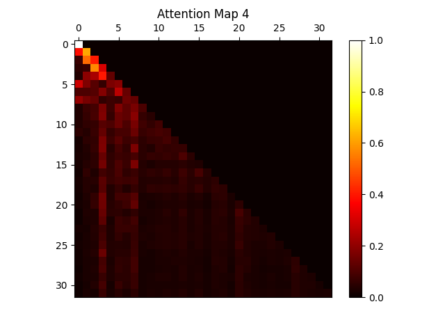
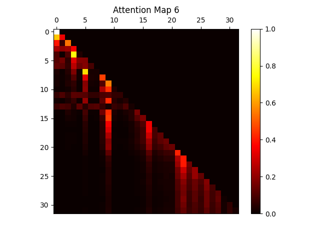
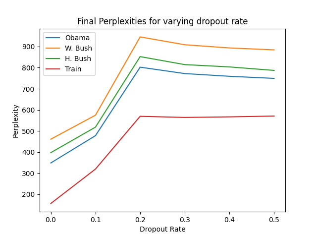

Encoder-Decoder Transformer

Run the following command to run the project:

python main.py -part1 -part2 -part3

The flags -part1, -part2, -part3 are optional. You may only include those flags corresponding to the parts you wish to run.

Part 1: Encoder Trained With Classifier

To perform the sanity check on the Encoder that was trained, the following sentences were run through the trained Encoder model, and the attention matrices were evaluated. Sentence 1: "And it's not just my belief." The corresponding attention matrix for this sentence (Layer 3, Head 1) is shown in Figure 1. As we can see the weights of the matrix, are concentrated around the 2nd token in the sequence. This word refers to "it's" which is a possessive pronoun. This makes sense because all the words have to "contain information" about this word because this word encapsulates the context of the entire sentence. Similarly, the Sentence 2 that was considered for the sanity check: "Yet compassion is the work of a nation, not just a government." The corresponding attention matrix for this sentence (Layer 2, Head 2) is shown in Figure 2. The words which have the maximum attention are "not", which being a negation influences the semantics greatly of the rest of the sentence. "Yet" also has a reasonably high attention since it influences the semantics of the rest of the sentence greatly.

The table below showcases the Performance Evaluation of the Encoder+Classifier model:
| Description          | Value    |
|----------------------|----------|
| Number of Parameters | 576,339  |
| Vocabulary Size      | 5,755    |

| Epoch | Train Loss | Train Accuracy | Test Accuracy |
|-------|------------|----------------|---------------|
| 1     | 1.079      | 0.431          | 0.383         |
| 2     | 1.036      | 0.463          | 0.333         |
| 3     | 0.944      | 0.528          | 0.472         |
| 4     | 0.874      | 0.576          | 0.503         |
| 5     | 0.793      | 0.609          | 0.585         |
| 6     | 0.703      | 0.660          | 0.592         |
| 7     | 0.623      | 0.702          | 0.665         |
| 8     | 0.565      | 0.712          | 0.664         |
| 9     | 0.508      | 0.757          | 0.752         |
| 10    | 0.426      | 0.809          | 0.733         |
| 11    | 0.367      | 0.852          | 0.788         |
| 12    | 0.280      | 0.892          | 0.781         |
| 13    | 0.245      | 0.907          | 0.744         |
| 14    | 0.177      | 0.938          | 0.821         |
| 15    | 0.115      | 0.959          | 0.836         |

Part 2: Pretraining Decoder Language Model

To perform the sanity check on the Decoder that was trained, the following sentences were run through the trained Decoder model, and the attention matrices were evaluated on the same sentences that were used in Part 1. In addition to the standard sanity check, using the same sentences allows us to see how the masked attention is different for the same sample sequences. Sentence 1: "And it's not just my belief." The  attention matrix for this sentence (Layer 2, Head 2) is shown in Figure 3. As we can see the weights of the matrix, are concentrated around the 4th token in the sequence: "just". It makes intuitive sense from a  semantic standpoint why this word might have more attention, when all future words are masked. Sentence 2: "Yet compassion is the work of a nation, not just a government." The corresponding attention matrix for this sentence (Layer 3, Head 2) is shown in Figure 4. The words which have the maximum attention are "not" again, which being a negation influences the semantics greatly of the rest of the sentence, same as in part 1. However, now we do notice that a lot of padding words which are not actually a part of the input sequence, are receiving a lot of attention. Hence, this might be representative of a deficit or unwanted quality of this particular attention head of this layer.

The perplexities vary because they are tested on different datasets and this is a reflection of the consistency of word choice and speech patterns of each of the presidents that make it predictable for our model:

| Description          | Value    |
|----------------------|----------|
| Number of Parameters | 943,611  |
| Vocabulary Size      | 5,755    |

| Step | Train     | Obama     | H. Bush   | W. Bush   |
|------|-----------|-----------|-----------|-----------|
| 0    | 6098.473  | 6130.603  | 6131.573  | 6117.194  |
| 100  | 553.589   | 669.221   | 705.347   | 793.561   |
| 200  | 369.477   | 493.030   | 536.340   | 611.141   |
| 300  | 266.810   | 419.178   | 462.378   | 529.619   |
| 400  | 202.280   | 369.734   | 432.457   | 499.512   |
| 500  | 156.200   | 348.337   | 397.217   | 461.071   |

Part 3: Exploration

The following architectural changes were explored:
Trigonometric Positional Encoding
A fixed sin wave and cos wave were considered (i.e. their shape was not trained through backpropagation). The sum of their values at different time positions (positions along the input sequence upto max of block\_size=32) was then considered to be the positional encoding instead of a standard positional encoding at different positions. The sin wave and cos wave were constructed such that each of the 32 positions would have a different positional encoding. Interestingly, this change made no difference to either the Encoder or the Decoders performance. Even though in both cases, the position of each token results in a unique number being added to the embedding, apparently the magnitude/order of these positional encodings do not matter so long as they are unique. Implementation can be found in the code.

Dropout Layers
Dropout layers were added to the feedforward neural net in each encoder layer, each decoder layer, as well as the classifier modules. However, after quick expetimentation, the dropout layers were removed from the encoder layers, and only retained in the classifier nn and decoder layers. The rates of dropout were varied and the following observations were made regarding the final test accuracy of the encoder (after 15 epochs), and the perplexities after 500 steps on the Train, Obama, H. Bush, W. Bush sets:

| Dropout Rate | Train    | Obama    | H. Bush  | W. Bush  | Test Accuracy (Encoder) |
|--------------|----------|----------|----------|----------|--------------------------|
| 0.0          | 156.200  | 348.337  | 397.217  | 461.071  | 83.6                     |
| 0.1          | 319.366  | 477.722  | 518.134  | 574.700  | 84.66                    |
| 0.2          | 569.487  | 802.315  | 852.376  | 945.843  | 74.4                     |
| 0.3          | 564.061  | 771.998  | 814.459  | 908.635  | 64.9                     |
| 0.4          | 566.763  | 759.090  | 803.490  | 893.504  | 56.8                     |
| 0.5          | 570.727  | 749.191  | 786.958  | 884.303  | 60.3                     |

Performance Improvement
Building off of my findings in the Architecture Exploration, I decided to improve on the performance of the Classifier (Encoder and Classifier) on the test set. I retained the trigonometric positional encoding for this classifier. In addition, I maintained the dropout layers with rate 0.1, not in the feedforward layer of each of the 4 encoder layers, but only in the classifier neural net. In addition to these changes, I modified the learning rate of the optimizer to be 9e-4. These simple changes resulted in a test accuracy of 86.7\%, which is greater than 2\% increase on the test set.
